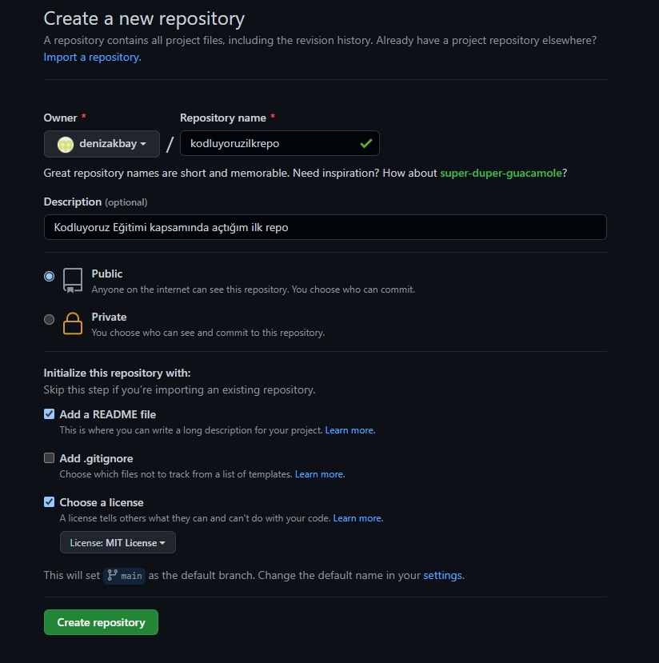

# Kodluyoruz Ilk Repo

Bu repo [Kodluyoruz](<https://www.kodluyoruz.org/>) Eğitimi kapsamında açtığım ilk repo. İçerisinde bir adet README dosyası, bir adet index.html barındırıyor.

## Installation

Öncelikle projeyi klonlayın.(Buraya reponuzdan aldığınız link gelecek)

> git clone "https://github.com/denizakbay/kodluyoruzilkrepo.git"

## Usage

Projeyi cloneladıktan sonra Visual Studio Code programında açınız.

Linux için:

>cd kodluyoruzilkrepo
>code .

## Contributing

Pull requestler kabul edilir. Büyük değişiklikler için, lütfen önce neyi değiştirmek istediğinizi tartışmak için bir konu açınız.

## License

[MIT](<https://choosealicense.com/licenses/mit/>)
